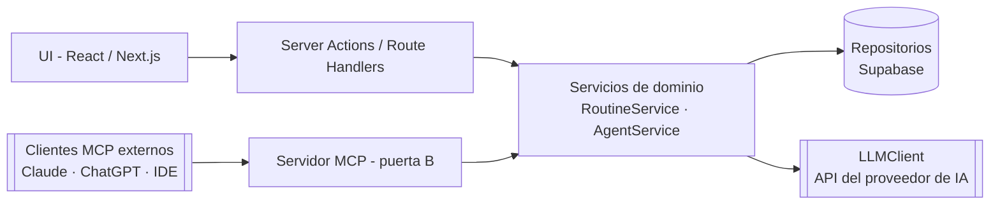

# RutIA — Especificación técnica y de producto

> **Tu semana, organizada conversando.**
> Un calendario de rutina semanal —trabajo, deporte, estudio, medicación, comidas— que se modifica hablando con un agente de IA. Lo recurrente es el corazón de la app.

| Campo | Valor |
|---|---|
| Proyecto | **RutIA** — rutina semanal recurrente gestionada por un agente de IA |
| Versión del documento | 2.4 |
| Licencia | MIT |
| Estado | En desarrollo (v1) |

**Sobre este documento:** es la fuente de verdad del proyecto (*Spec Driven Development*): define visión, alcance, modelo de datos, comportamiento del agente y arquitectura, y sirve como contexto para los asistentes de IA usados durante el desarrollo. Cualquier cambio de diseño se refleja aquí primero.

---

## 1. Visión

Organizar la semana con apps de calendario tradicionales exige formularios, clics y menús, y las apps de hábitos ignoran tu horario real. **RutIA** une ambas cosas: tu **rutina semanal recurrente** siempre visible en un calendario, y a su lado un agente de IA al que simplemente le hablas:

- «Recuérdame la medicación todos los días a las 9:00 y a las 21:00»
- «Gimnasio lunes y miércoles de 19:00 a 20:30»
- «Muéveme el inglés del jueves a la mañana»
- «Los martes ceno pasta y los jueves pescado» *(tu dieta, dictada por ti)*
- «¿Qué me toca hoy?» · «Ya me tomé la pastilla»

El agente interpreta la petición, **modifica la rutina mediante herramientas** (function calling) y el calendario se actualiza en pantalla al instante. También puede **generar una rutina inicial completa** a partir de una descripción libre de tu vida, detectar **conflictos de horario** entre bloques y responder **preguntas** sobre tu semana o tu día.

**Conceptos clave:**
- La rutina es una **plantilla semanal recurrente**: cada ítem vive en uno o varios días de la semana («todos los días», «de lunes a viernes», «L y X»).
- Hay dos tipos de ítem: **bloques** con franja horaria (trabajo 9:00–17:00) y **recordatorios puntuales** a una hora concreta (medicación 9:00), que se muestran como chips sobre el calendario.
- El panel **«Hoy»** lista lo que toca hoy en orden y permite **marcarlo como hecho** (a mano o por chat).
- La semana se puede **exportar como imagen** con diseño limpio: imprímela o ponla de fondo de pantalla.
- **Doble puerta de IA:** chat integrado en la app (vía API) y, como extra, **modo MCP** para gestionar tu rutina desde tu propio Claude, ChatGPT o IDE, con la suscripción que ya pagas.
- **Abierta para todos:** cualquiera la usa registrándose en la URL pública, y cualquier desarrollador puede montarse su propia instancia en ~15 minutos (open source, licencia MIT).

**Propuesta de valor / diferenciación:** no es un chatbot que da consejos ni un calendario más; es tu rutina recurrente cuya interfaz principal es la conversación. La IA no acompaña al producto: **es** el producto.

---

## 2. Alcance (MoSCoW)

### Must — el corazón de la v1
1. Registro e inicio de sesión con email y contraseña (Supabase Auth) + **usuario de prueba** con rutina precargada.
2. Vista de **calendario semanal** (lunes–domingo × horas) con bloques coloreados por categoría y **chips** para los recordatorios puntuales.
3. Ítems con **recurrencia multi-día** (`days[]`): un solo ítem puede vivir en varios días («todos los días», «L-V»).
4. **CRUD manual básico** de ítems desde la UI (crear, editar, borrar) como alternativa al chat.
5. **Chat con el agente** que modifica la rutina mediante herramientas: crear, editar/mover, borrar, vaciar día, creación masiva y marcar completado.
6. Cambios del agente **reflejados inmediatamente** en el calendario, con resaltado breve de los ítems afectados.
7. **Generación de rutina inicial** a partir de una descripción libre («trabajo de 9 a 17, gym 3 días, medicación a las 9 y a las 21…»).
8. **Detección de solapes entre bloques**: el agente avisa del conflicto y propone alternativa antes de pisar nada (los recordatorios puntuales no generan conflicto).
9. Panel **«Hoy»**: lista ordenada de lo que toca hoy con **casilla de completado** (imprescindible para medicación); también se marca por chat («ya me la tomé»).
10. **Comidas como ítems de rutina**: el usuario dicta su dieta («los martes ceno pasta») y queda registrada en el detalle del ítem. El agente **no inventa menús ni da consejos médicos o nutricionales**.
11. Persistencia por usuario en Supabase con **RLS** (cada usuario solo ve lo suyo).
12. Diseño **responsive** (uso real desde el móvil, con «Hoy» como vista principal).
13. **Exportación de la semana**: botón que genera una **imagen PNG** de la rutina con diseño limpio (sin interfaz), lista para imprimir o usar de fondo de pantalla, más **vista imprimible** con estilos de impresión del navegador.
14. Desplegado en producción (Vercel) con URL pública.

### Should — segunda oleada, solo con el Must cerrado
- **Modo MCP (v1):** servidor MCP remoto que expone las 6 herramientas sobre `RoutineService`; autenticación por **token personal** generado en ajustes; guía de conexión en el README (Claude, ChatGPT, IDEs). Coste de inferencia: cero para la app — el modelo lo pone el cliente del usuario.
- **Instalable por terceros (plug and play):** botón «Deploy with Vercel» en el README y guía de autoinstalación paso a paso (proyecto gratuito de Supabase + ejecutar la migración SQL + 3 variables de entorno, ~15 minutos). Quien se autoinstala pone su propia API key y paga su propio consumo.
- Historial de conversación persistente entre sesiones.
- **Deshacer** el último cambio del agente (snapshot previo de la rutina).
- **Cumplimiento semanal** simple por ítem (p. ej. «Medicación: 6/7 esta semana») y rachas básicas.
- Insights por chat: «¿cuántas horas dedico a estudio?», equilibrio de la semana.
- Export en **formato vertical para móvil** (agenda por días, tamaño de fondo de pantalla) y elección de tema claro/oscuro de la lámina.
- Acciones rápidas: duplicar día, limpiar semana.

### Could — extras si sobra tiempo
- Excepciones para una semana concreta (sin romper la plantilla recurrente).
- Modo MCP avanzado: autenticación **OAuth 2.1** y refresco del calendario **en tiempo real** (Supabase Realtime) mientras chateas desde tu cliente externo.
- Ajuste **BYOK** en el chat integrado: el usuario puede poner su propia API key (pago por uso; no es su suscripción).
- Lista de la compra generada desde las comidas que el usuario ha dictado.
- Avisos del navegador mientras la app está abierta (Notification API).
- Exportar en formato calendario (.ics), modo oscuro de la app, PWA instalable, streaming de respuestas.

### Won't — fuera de la v1 (recogidas como líneas futuras)
- Notificaciones push reales en móvil, sugerencia de menús/dietas por IA, integración con Google Calendar, rutinas compartidas/multiusuario, entrada por voz.
- Consumir la **suscripción de consumidor** del usuario (ChatGPT Plus, Claude Pro…) dentro del chat integrado: hoy no existe un mecanismo general para apps de terceros; el **modo MCP es precisamente la alternativa** que lo consigue.

> **Regla de oro:** si algo del *Should* amenaza al *Must*, se corta. La v1 se cierra con un Must impecable, no con un Could a medias.

---

## 3. Historias de usuario

1. Como usuario nuevo, describo mi vida en un mensaje y obtengo una rutina semanal inicial completa.
2. Como usuario, digo «recuérdame la medicación todos los días a las 9 y a las 21» y aparecen los chips en los 7 días.
3. Como usuario, digo «gimnasio lunes y miércoles de 19:00 a 20:30» y se crea un único ítem en ambos días.
4. Como usuario, pido «muéveme el estudio del jueves a la mañana» y el bloque cambia de sitio.
5. Como usuario, pido «elimina todo lo del domingo por la tarde» y el agente confirma antes de borrar en masa.
6. Como usuario, dicto mi dieta («los martes ceno pasta») y el detalle queda visible en el ítem de la cena.
7. Como usuario, pregunto «¿qué me toca hoy?» y el agente me lista el día en orden, sin tocar nada.
8. Como usuario, digo «ya me tomé la pastilla» y el recordatorio de hoy queda marcado como hecho.
9. Como usuario, marco o desmarco a mano cualquier ítem de hoy desde el panel «Hoy».
10. Como usuario, si pido algo que solapa con otro bloque, el agente me avisa y propone alternativas.
11. Como usuario, puedo crear o retocar un ítem a mano sin usar el chat.
12. Como usuario, cierro sesión, vuelvo otro día y mi rutina, mis checks y mi conversación siguen ahí.
13. Como usuario, pulso «Exportar» y descargo mi semana como imagen limpia para imprimirla o ponerla de fondo de pantalla.
14. Como usuario, genero un token en ajustes, añado RutIA como conector MCP en mi Claude o ChatGPT y gestiono mi rutina desde allí con mi propia suscripción.
15. Como desarrollador externo, encuentro el repo en GitHub, pulso «Deploy with Vercel», sigo la guía de autoinstalación y en ~15 minutos tengo mi propia instancia de RutIA con mis claves.

---

## 4. Experiencia de usuario

**Pantallas:**
- `/login` y `/registro` — formularios mínimos, mensaje de error claro.
- `/app` — pantalla única de trabajo:
  - **Escritorio:** calendario semanal (columnas L–D, filas por horas, 06:00–24:00 por defecto) + panel derecho con pestañas **Chat** y **Hoy**.
  - **Móvil:** vista **«Hoy»** como pantalla principal (lista con checks), calendario semanal deslizable y chat como panel flotante.
- Primera visita: el agente saluda y ofrece crear la rutina inicial (onboarding conversacional, sin tutorial).

**Detalles de acabado:**
- Los recordatorios puntuales se pintan como **chips** anclados a su hora; los bloques, como tarjetas con altura proporcional a su duración.
- Los ítems recién creados o movidos se resaltan ~2 s: feedback visual inmediato de lo que acaba de hacer el agente.
- Colores por categoría con leyenda: Trabajo, Estudio, Deporte, **Salud**, Comidas, Hogar, Ocio, Descanso (editables).
- Los ítems muestran su detalle como subtítulo (p. ej. «Cena · Pasta», «Medicación · Enalapril 10 mg»).
- Indicador «pensando…» mientras el agente trabaja; mensajes del agente breves y accionables.

**Exportación (lámina):** botón «Exportar» en la cabecera del calendario. Genera una **lámina dedicada** —un componente aparte renderizado fuera de pantalla a resolución fija (p. ej. 1920×1080)— con la semana completa, título y leyenda de categorías, convertida a PNG en el navegador con una librería tipo `html-to-image`. La misma lámina sirve como **vista imprimible** (`@media print`, ocultando chat y paneles). El formato vertical para móvil es la variante del *Should*.

---

## 5. Modelo de datos (Postgres / Supabase)

La rutina es una **plantilla semanal recurrente**: los ítems viven en días-de-la-semana + horas, no en fechas. (Extensión futura: tabla de excepciones por semana.)

| Tabla | Campos principales | Notas |
|---|---|---|
| `profiles` | `id` (= auth.users.id), `display_name`, `timezone`, `preferences jsonb` | Se crea con trigger al registrarse |
| `categories` | `id`, `user_id`, `name`, `color` | Seed de 8 categorías por defecto al crear perfil (incluidas «Salud» y «Comidas») |
| `routine_items` | `id`, `user_id`, `title`, `category_id`, `kind` ('block' \| 'reminder'), `days smallint[]` (0=lunes … 6=domingo), `start_time` (time), `end_time` (time, null si reminder), `detail` (texto corto: plato, dosis…), `notes`, `created_at`, `updated_at` | Check: si `kind='block'` entonces `end_time > start_time`; `days` no vacío |
| `completions` | `id`, `user_id`, `item_id`, `date` (date), `completed_at` | Unique (`item_id`, `date`) — un check por ítem y día |
| `chat_messages` | `id`, `user_id`, `role` ('user' \| 'assistant'), `content`, `tool_calls jsonb`, `created_at` | Historial del chat |
| `routine_snapshots` (Should) | `id`, `user_id`, `data jsonb`, `created_at` | Estado previo para «deshacer» |

**RLS obligatoria en todas las tablas:** política `user_id = auth.uid()` para SELECT/INSERT/UPDATE/DELETE. Sin excepciones.

> **Nota de diseño:** un ítem que ocurre «todos los días» es **una sola fila** con `days=[0,1,2,3,4,5,6]`. Editar su hora es un solo cambio; el calendario lo pinta en cada día de su array. La dieta la escribe el usuario en `detail`; no hay recetario ni generación de menús en la v1.

---

## 6. El agente

### 6.1 Patrón: bucle agéntico con herramientas

1. El usuario envía un mensaje.
2. El servidor construye el contexto: system prompt + **rutina actual completa serializada** (es pequeña, siempre cabe) + estado de los checks de hoy + últimos N mensajes.
3. El LLM responde con texto o con **llamadas a herramientas**.
4. El servidor ejecuta cada herramienta (validación Zod → comprobación de solapes → escritura en BD) y devuelve el resultado al LLM.
5. Se repite hasta que el LLM responde solo texto (máximo **5 rondas** por mensaje, por coste y seguridad).
6. Se devuelve la confirmación al chat y el front **refresca el calendario y el panel «Hoy»**.

**Decisión de diseño:** la rutina se inyecta siempre en el contexto (no hay herramienta de lectura). Así el agente nunca «alucina» IDs y las herramientas son solo de escritura → menos rondas, menos errores, menos coste.

### 6.2 Herramientas (contrato)

| Herramienta | Parámetros | Efecto |
|---|---|---|
| `create_item` | `title, kind ('block'\|'reminder'), days[0-6][], start ("HH:MM"), end? (obligatorio si block), category?, detail?, notes?` | Crea un ítem recurrente |
| `update_item` | `item_id, campos opcionales (title, kind, days, start, end, category, detail, notes)` | Edita, mueve o cambia el detalle de un ítem |
| `delete_items` | `item_ids[]` | Borra uno o varios ítems |
| `clear_day` | `day, franja opcional (from, to)` | Quita ese día del array de los ítems afectados; si un ítem se queda sin días, se borra |
| `bulk_create_items` | `items[]` | Rutina inicial o cambios masivos |
| `set_completed` | `item_id, done (bool)` | Marca o desmarca el ítem como hecho **hoy** (la fecha la pone el servidor) |

Reglas comunes de toda herramienta (en el servidor, nunca fiadas al modelo):
- El `user_id` **lo pone el servidor** desde la sesión; el modelo jamás lo envía ni lo ve.
- Validación estricta con Zod (formatos de hora, días 0-6, título ≤ 80 caracteres, `detail` ≤ 120…).
- Comprobación de solapes **solo entre bloques** que compartan algún día: si hay conflicto, la herramienta **no escribe** y devuelve el conflicto para que el agente lo negocie con el usuario. Un recordatorio dentro de un bloque es válido (tomar la pastilla en horario de trabajo es lo normal).
- Toda ejecución se registra (log) para observabilidad.

### 6.3 System prompt (borrador v1 — se itera durante el desarrollo)

```text
Eres RutIA, un asistente que gestiona la rutina semanal recurrente del usuario.
Fecha actual: {{FECHA}} ({{DIA_SEMANA}}). Zona horaria del usuario: {{TIMEZONE}}.

RUTINA ACTUAL DEL USUARIO:
{{RUTINA_SERIALIZADA}}  // ítems con id, kind, days, horas, título, categoría, detail

CHECKS DE HOY:
{{COMPLETADOS_HOY}}  // item_id → hecho / pendiente

REGLAS:
1. Cuando el usuario pida cambios, usa las herramientas. No describas cambios sin ejecutarlos.
2. Usa siempre los `item_id` que aparecen en la rutina actual. Nunca inventes IDs.
3. Horas en formato 24 h. La semana empieza en lunes (day=0). «Todos los días» = days=[0,1,2,3,4,5,6]; «entre semana» = [0,1,2,3,4].
4. Usa kind='reminder' para eventos puntuales (medicación, llamadas, riego…) y kind='block' para franjas con duración.
5. Si una acción borra o modifica 3+ ítems, pide confirmación antes de ejecutar.
6. Si detectas un conflicto de horario entre bloques, no lo pises: explica el choque y propone 1-2 alternativas.
7. Si la petición es ambigua (¿qué días?, ¿qué hora?), haz UNA pregunta corta.
8. Si el usuario dicta su dieta o una dosis, regístrala tal cual en `detail`. No inventes menús, no cambies dosis, no des consejos médicos ni nutricionales; si te los piden, recomienda consultar a un profesional.
9. «¿Qué me toca hoy/ahora?» se responde leyendo la rutina y los checks del contexto, sin herramientas.
10. Cuando el usuario diga que ya hizo algo de hoy, usa set_completed.
11. Al generar una rutina inicial, respeta horas de sueño razonables y reparte con equilibrio.
12. Responde en español, en 1-3 frases, con tono cercano. Tras ejecutar, resume qué has cambiado.
13. Solo gestionas la rutina. Si te piden otra cosa, redirige con amabilidad.
```

### 6.4 Proveedor de IA (puerta A: chat integrado)

- **Un solo proveedor en el MVP**, elegido al inicio: Anthropic (`claude-sonnet-4-6`) u OpenAI (modelo equivalente con tool use fiable). Ambos soportan el patrón; elige el que te resulte más cómodo de facturación.
- La llamada vive detrás de una interfaz propia (`AgentService` → `LLMClient`), de modo que cambiar de proveedor sea tocar un solo archivo.
- API key **solo en el servidor**, vía variable de entorno. Presupuesto estimado: céntimos por conversación; poner tope de gasto en el panel del proveedor.

### 6.5 Modo MCP: la segunda puerta (Should)

El **servidor MCP de RutIA** expone exactamente las mismas 6 herramientas, implementado como un adaptador fino sobre `RoutineService` (ni una línea de lógica duplicada). El usuario genera un **token personal** en los ajustes de la app, añade RutIA como conector MCP en su cliente (Claude, ChatGPT, su IDE…) y gestiona la rutina conversando desde allí — **con su propia suscripción y coste cero de inferencia para la app**.

Detalles de diseño:
- Aquí no hay system prompt nuestro: el «prompt» son las **descripciones de las herramientas**, así que se redactan con el mismo mimo (qué hace cada una, formato de días y horas, cuándo usar `reminder`).
- Los tokens se guardan **hasheados**, son revocables desde ajustes y solo dan acceso a los datos del propio usuario (mismas garantías que la sesión web).
- Ambas puertas escriben en la misma base de datos; con Supabase Realtime (*Could*) el calendario abierto en la web se refresca en vivo mientras chateas desde tu cliente.
- Evolución natural (*Could*): autenticación **OAuth 2.1**, el estándar de los servidores MCP remotos.

---

## 7. Stack y arquitectura

### 7.1 Stack

| Capa | Tecnología | Por qué |
|---|---|---|
| Framework | **Next.js (App Router) + TypeScript** | Full-stack en un solo repo, ecosistema maduro y despliegue directo en Vercel |
| UI | Tailwind CSS (+ shadcn/ui opcional) | Rapidez y acabado profesional |
| BBDD + Auth | **Supabase** (Postgres, Auth, RLS) | Login resuelto, capa gratuita, RLS = seguridad demostrable |
| IA | API de Anthropic u OpenAI (tool use) + servidor **MCP** propio | Núcleo del proyecto: doble puerta |
| Validación | Zod | Fronteras seguras entre modelo, servidor y BD |
| Testing | Vitest (unit) + Playwright (E2E) | Unit rápidos para servicios y validación; E2E realistas de los flujos clave |
| Observabilidad | Sentry | Errores y rendimiento en producción con capa gratuita |
| Revisión de código | **CodeRabbit** | Revisión con IA de cada PR (resumen, riesgos, sugerencias); gratuito en repositorios públicos |
| CI/CD | GitHub Actions + Vercel | Lint/tests en cada PR, despliegue automático |

### 7.2 Capas (Clean Architecture pragmática)



- **UI** no habla nunca directamente con Supabase ni con el LLM.
- **Servicios** contienen la lógica: solapes, recurrencia, checks de hoy, ejecución de herramientas, bucle del agente.
- **Repositorios** encapsulan el acceso a datos.
- Tipos compartidos + esquemas Zod en `lib/schemas`.

### 7.3 Estructura de carpetas propuesta

```text
rutia/
├── AGENTS.md                  ← reglas y base de conocimiento para los agentes de IA del IDE
├── CLAUDE.md                  ← puntero a AGENTS.md (Claude Code)
├── docs/
│   └── ESPECIFICACION.md      ← este documento
├── src/
│   ├── app/                   # rutas: login, registro, app
│   │   ├── api/chat/route.ts  # endpoint del agente (puerta A)
│   │   └── api/mcp/route.ts   # servidor MCP (puerta B, Should)
│   ├── components/            # Calendario, ItemBloque, ItemChip, PanelHoy, Chat, LaminaExport, …
│   ├── services/              # routine.service.ts · agent.service.ts · llm.client.ts
│   ├── repositories/          # items.repo.ts · completions.repo.ts · chat.repo.ts · categories.repo.ts
│   ├── lib/                   # schemas.ts (Zod) · supabase clients · utils
│   └── tests/                 # unit
├── e2e/                       # Playwright
├── supabase/                  # migraciones SQL (tablas + RLS + seed)
├── .github/workflows/ci.yml
├── .env.example
└── README.md
```

---

## 8. Seguridad (mapeo OWASP resumido)

| Riesgo | Mitigación en RutIA |
|---|---|
| Control de acceso roto (A01) | RLS en todas las tablas + sesión verificada en cada server action |
| Secretos expuestos (A02) | API keys solo en env del servidor; `.env.example` documentado; nada de claves en el cliente ni en Git |
| Inyección (A03) | Consultas vía SDK de Supabase (parametrizadas) + validación Zod de toda entrada |
| Diseño inseguro (A04) | Las herramientas del agente nunca reciben `user_id` del modelo; confirmación para borrados masivos |
| Abuso / coste | Rate limiting por usuario en `/api/chat` (p. ej. 20 mensajes / 5 min) y tope de gasto en el proveedor |
| Prompt injection | El agente solo puede ejecutar las 6 herramientas, siempre sobre los datos del propio usuario; reglas del system prompt + validación servidor |
| Tokens del modo MCP | Generados por el usuario, guardados con hash, revocables desde ajustes y limitados a las herramientas sobre sus propios datos |
| Datos sensibles (salud) | La medicación es dato personal: RLS estricta, sin analítica de terceros sobre contenidos, y el usuario puede borrar sus ítems |

---

## 9. Calidad

- **Unit (Vitest):** lógica de solapes multi-día, validaciones Zod, semántica de `clear_day`, idempotencia de `set_completed`, mapeo de tool calls → repositorios, `AgentService` con el LLM **mockeado**. Objetivo orientativo: ≥ 70 % de cobertura en `services/`.
- **E2E (Playwright):** flujo feliz — registro/login → crear ítem manual → enviar mensaje al chat (LLM mockeado o fixture) → el ítem aparece en el calendario → marcar un check en «Hoy».
- **Estática:** ESLint + Prettier + `tsc --noEmit` en CI.
- **Observabilidad:** Sentry en cliente y servidor; log estructurado de cada tool call (herramienta, duración, resultado).
- **Flujo de desarrollo asistido por IA:** el repositorio incluye `AGENTS.md` (stack, comandos, convenciones y definición de hecho) como base de conocimiento para los agentes del IDE, que trabajan contra esta especificación (*spec-driven*). Cada Pull Request recibe además una revisión automática de **CodeRabbit** (resumen, riesgos y sugerencias), cuyos hallazgos se triagean como cualquier revisión humana antes del merge.

---

## 10. CI/CD y despliegue

- **GitHub Actions** en cada push/PR: install → lint → typecheck → tests.
- **Flujo de trabajo:** rama por funcionalidad → Pull Request → revisión automática (CodeRabbit) + checks de CI → merge. `main` se mantiene siempre desplegable.
- **Vercel:** preview automática por PR, producción en `main`. Variables de entorno configuradas en Vercel (LLM) y Supabase (BD).
- Desplegar **desde el primer día** (aunque solo sea el login): la rama `main` siempre tiene una versión funcionando y las sorpresas de despliegue aparecen pronto, cuando son baratas.
- **Distribución open source:** el README incluirá un botón «Deploy with Vercel» (clona el repo a la cuenta del visitante y le pide las variables de entorno) y la guía de autoinstalación. La migración `supabase/migrations/0001_init.sql` y el `.env.example` documentado son las otras dos piezas que lo hacen plug and play.

---

## 11. Riesgos y mitigaciones

| Riesgo | Mitigación |
|---|---|
| El agente falla o tarda | CRUD manual como red de seguridad; límite de rondas y timeouts |
| Scope creep | MoSCoW estricto; el *Should* solo se arranca con el *Must* cerrado |
| Coste del LLM | Contexto compacto, máx. 5 rondas, rate limiting, tope de gasto en el proveedor |
| Ámbito salud | La app organiza recordatorios personales que el usuario define; no es un dispositivo médico, no pauta ni ajusta medicación ni dietas. Aviso breve en README y onboarding |
| El export de imagen da guerra (fuentes, tamaños) | Lámina dedicada con estilos simples y resolución fija; librería `html-to-image`; probarlo en cuanto exista el calendario |
| Complejidad del modo MCP | Es *Should* y se apoya en el mismo `RoutineService`; v1 con token personal (OAuth 2.1 queda como línea futura) |
| Servicios gratuitos | Vercel, Supabase y Sentry tienen capa gratuita suficiente para un despliegue personal |

---

## 12. Nombre y roadmap

- Nombre del proyecto: **RutIA** (rutina + IA). Nombre técnico: `rutia`.
- **Roadmap (líneas futuras):** excepciones semanales, notificaciones push, sugerencia de menús por IA, lista de la compra, estadísticas de hábitos y rachas avanzadas, más formatos de exportación (PDF, tamaños exactos de cada móvil), OAuth 2.1 y tiempo real para el modo MCP, self-hosting completo con docker-compose, Google Calendar, rutinas compartidas, voz, PWA.

### Endurecimientos aplazados conscientemente (deuda técnica registrada)

Señalados por revisión (CodeRabbit, PR #6) y aplazados en v1 por decisión de diseño; se retoman si el uso multi-puerta (web + MCP) los convierte en problema real:

1. **Concurrencia optimista en `updateItem`** — el patrón leer-mezclar-escribir puede perder una edición concurrente sobre el mismo ítem (último en escribir gana). Aplazado: en una app personal la carrera realista es mínima y recuperable. Implementación prevista sin migración: usar `updated_at` como revisión esperada en el `WHERE` del update (`items.repo.update`) y devolver conflicto si afecta 0 filas.
2. **Solapes de bloques reforzados en BD** — dos escrituras simultáneas podrían pasar ambas la comprobación del servicio e insertar bloques solapados. Aplazado: la spec (§6.2) sitúa los solapes en el servicio porque el conflicto es un resultado que el agente negocia, y el agente ejecuta herramientas en secuencia. Implementación prevista: trigger de exclusión por `(user_id, día ∈ days, franja)` en una migración futura, mapeando su error a `reason: 'conflict'`.
3. **Prettier en CI** — §9 lo promete pero aún no está en el repo (ni dependencia ni config). Aplazado: introducirlo exige un formateo inicial de todo el código en un chore dedicado, para no mezclar churn de formato en PRs funcionales. Implementación prevista: `prettier` como devDependency + `format:check` en el workflow de CI entre Lint y Typecheck.
4. **`24:00` no es editable desde el formulario manual** — `endTimeSchema` acepta `24:00` (la rejilla de §4 llega ahí y Postgres lo admite), pero `<input type="time">` solo llega a 23:59: al abrir un ítem que termine a medianoche, el campo Fin sale vacío y, al ser obligatorio, bloquea el guardado. Hoy es latente porque ningún camino crea ese valor (el formulario no puede y el agente no existe todavía). Se resolverá al implementar el agente (§6.2), eligiendo entonces entre una casilla «hasta medianoche» en el formulario o normalizar a 23:59 en todo el dominio.
